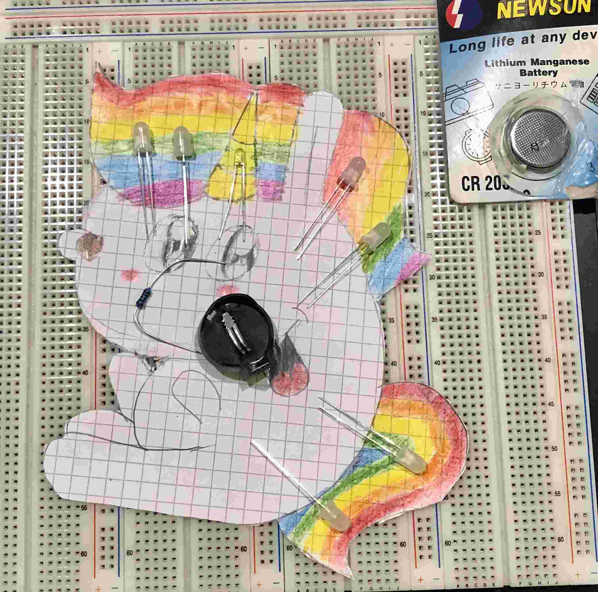

# Rainbow Unicorn 2

This unicorn with rainbow colored hair and tail has just entered the zone between imagination and reality.
The idea is based on [RainbowUnicorn01](../RainbowUnicorn01/README.md) and [RainbowButterfly](../RainbowButterfly/README.md).

- Status: **Just an Idea, Not real yet**
- Difficulty: **to be defined**

## Parts List

| Description                   | Quantity |
|-------------------------------|----------|
| RGB LEDs 5mm                  |     7    |
| Yellow LEDs 3mm               |     1    |
| Resistor, 100 Ohm             |     1    |
| Button (SMD)                  |     1    |
| CR2032 Battery Holder (SMD)   |     1    |
| CR2032 Battery (not included) |     1    |

## Copyright and Authorship

to be defined.

## Buy Soldering Kits

not available
